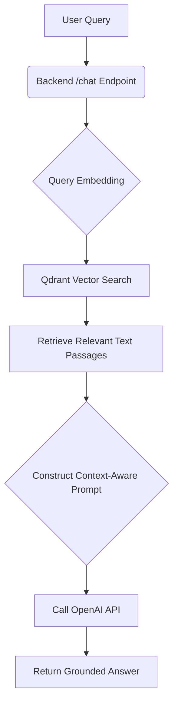

# Feature Specification: 005-rag-qdrant

## 1. Overview & RAG Architecture Diagram

### Overview

This specification outlines "Phase 5: Use Qdrant Cloud and make a tool which OpenAI Agent uses for RAG purpose. Also sync your book content into vectordb." This is the final development phase of a hackathon to build an AI-native "Physical AI & Humanoid Robotics" textbook.

The core objective is to enhance the Phase 2 backend (FastAPI chat endpoint) to become a Retrieval-Augmented Generation (RAG) pipeline. When a user asks a question, the system will first search the textbook's vector database (Qdrant Cloud) for relevant content and then instruct the OpenAI model to answer based only on that retrieved context. This ensures accurate, book-specific answers.

### RAG Architecture Diagram (Conceptual Data Flow)



**Components:**
*   **Embedding Model**: `text-embedding-3-small` or similar via OpenAI API.
*   **Vector Database**: Qdrant Cloud (serverless) to store and search document embeddings.
*   **RAG Orchestrator**: A new backend service/module (`rag_service.py`) that coordinates the retrieval and generation steps.

## 2. Data Pipeline Specification (Chunking, Embedding, Sync Tool)

This section details the process for ingesting the textbook content into the vector database.

### Source

All book content Markdown files from Phase 1 (Docusaurus `docs/` directory).

### Processing Steps

1.  **Chunking**:
    *   **Method**: Split Markdown content into semantically meaningful chunks.
    *   **Granularity**: Target chunks of approximately 200-400 words (e.g., by section, paragraph, or a fixed token window with overlap). The exact chunking strategy will be refined during implementation to optimize retrieval effectiveness.

2.  **Embedding**:
    *   **Model**: Generate a vector embedding for each text chunk using the chosen embedding model (`text-embedding-3-small` via OpenAI API).
    *   **API**: Utilize the OpenAI Embeddings API for vector generation.

3.  **Storage**:
    *   Store each chunk along with its embedding, original text, and metadata as a point in a Qdrant collection.

### Sync Tool (`sync_book_to_qdrant.py`)

*   **Purpose**: Create a script that can be run to (re)process the book content and update the vector database. This is crucial for the hackathon deliverable and for maintaining an up-to-date knowledge base.
*   **Functionality**:
    *   Iterate through all Markdown files in the Docusaurus `docs/` directory.
    *   For each file, perform the chunking and embedding steps.
    *   Store the resulting chunks, embeddings, and metadata in Qdrant Cloud.
    *   Handle updates/deletions of existing content (e.g., by replacing chunks with the same source/section identifier).
*   **Execution**: Designed to be run periodically or on-demand to synchronize book content changes.

## 3. Qdrant Cloud Configuration & Schema

### Collection Name

*   `physical_ai_textbook`

### Vector Configuration

*   **Size**: Matches the output dimension of the chosen embedding model (e.g., 1536 for `text-embedding-3-small`).
*   **Distance Metric**: Cosine similarity (common for text embeddings).

### Payload (Metadata) Schema

Each point in the Qdrant collection will store the following metadata:

*   `"text"`: `str` - The original text content of the chunk.
*   `"source"`: `str` - The file path of the original Markdown document (e.g., `docs/module1/chapter-1.md`).
*   `"chapter"`: `str` - The title or identifier of the chapter the chunk belongs to.
*   `"section"`: `str` - The heading or subsection title the chunk belongs to, providing more granular context.

## 4. Backend Modification Requirements (Service, Endpoint Logic, Prompts)

### New RAG Service (`rag_service.py`)

*   **Module**: `backend/src/services/rag_service.py`
*   **Function**: `get_relevant_context(query: str, limit: int = 3, selected_text: Optional[str] = None) -> List[Dict]`
    *   **Description**: Handles the Qdrant vector search to retrieve relevant text passages.
    *   **Parameters**:
        *   `query`: The user's original question.
        *   `limit`: The maximum number of relevant text passages to retrieve (default 3).
        *   `selected_text`: (Optional) User-selected text from the frontend, used to bias or refine the search.
    *   **Returns**: A list of dictionaries, each containing the retrieved `text` and its associated metadata (`source`, `chapter`, `section`).

### Enhanced `/chat` Endpoint Logic

The existing Phase 2 `POST /chat` endpoint will be modified to integrate the RAG pipeline.

*   **Input**: Accepts the user query and (optional) `selected_text`.
*   **Steps**:
    1.  Receive `message` (user query) and `session_id`, `selected_text` (optional) from the frontend.
        2. Use `selected_text` for metadata filtering: The RAG search will primarily focus on chunks originating from the same `source`, `chapter`, or `section` as the `selected_text`. This ensures highly relevant context from the user's current reading area. If `selected_text` is provided, the `get_relevant_context` function will prioritize searching within the relevant metadata-filtered subset of the Qdrant collection. If no results are found within the filtered subset, a broader search may be conducted as a fallback, but primary emphasis is on the selected text's context.
    3.  Call `get_relevant_context(query, limit=N, selected_text=selected_text)` to retrieve the top `N` most relevant book passages (e.g., N=3).
    4.  Construct a new, stricter system prompt for the OpenAI model:
        ```
        "You are an assistant for the 'Physical AI & Humanoid Robotics' textbook. Answer the user's question based ONLY on the following context from the book. If the answer isn't in the context, say so. 
        Context: 
        {retrieved_passages_concatenated}"
        ```
        *   `{retrieved_passages_concatenated}` will be a formatted string of the `text` field from the retrieved chunks.
    5.  Proceed with the OpenAI API call and response generation as before, using the new context-aware prompt.
    6.  Return the grounded answer to the frontend.

### New Endpoint (Optional)

*   **`POST /ingest` (admin)**
    *   **Purpose**: An administrative endpoint to trigger the book content sync process (`sync_book_to_qdrant.py`).
    *   **Security**: Requires authentication/authorization (e.g., API key, admin token) to prevent unauthorized ingestion.

## 5. Integration Plan with Existing Phases (2, 3)

### Phase 2 (FastAPI Backend)

*   The existing `/chat` endpoint will be modified to incorporate the RAG logic as detailed in Section 4.
*   A new `rag_service.py` module will be added to the `backend/src/services/` directory.
*   The `sync_book_to_qdrant.py` script will be a standalone tool, potentially triggered by a new `/ingest` endpoint or run manually/via CI/CD.

### Phase 3 (Docusaurus Chatbot UI)

*   The frontend `ChatBotWidget` will continue to send `selected_text` as part of the chat request, which the backend will now utilize for RAG.
*   The UI might be enhanced in future phases to visually indicate when RAG is active or when an answer is explicitly grounded in the book content (though not a direct requirement of this spec).

## 6. Validation & Testing Strategy

### Unit Tests

*   **`rag_service.py`**: Test the `get_relevant_context` function for correct Qdrant interaction, query embedding, and retrieval logic.
*   **Sync Tool**: Test individual functions within `sync_book_to_qdrant.py` (chunking, embedding, Qdrant upsert).

### Integration Tests

*   **`/chat` Endpoint (RAG Enabled)**:
    *   Verify that queries with and without `selected_text` correctly trigger Qdrant search.
    *   Ensure the generated prompt contains the retrieved context.
    *   Validate that OpenAI responses are grounded in the provided context (mock OpenAI API if needed).
    *   Test scenarios where no relevant context is found.
*   **`/ingest` Endpoint (if implemented)**: Test that triggering this endpoint correctly initiates the sync process.

### End-to-End Tests

*   Simulate a user asking questions through the Docusaurus Chatbot UI.
*   Verify that answers returned are consistently accurate and grounded in the textbook content.
*   Test the `selected_text` functionality from the UI through to the grounded response.

## 7. Acceptance Criteria (Checklist)

*   [ ] AC-001: Qdrant Cloud collection (`physical_ai_textbook`) is created and accessible by the backend.
*   [ ] AC-002: The `sync_book_to_qdrant.py` tool successfully processes all Phase 1 book Markdown files and populates the `physical_ai_textbook` vector database.
*   [ ] AC-003: The modified `POST /chat` endpoint performs a vector search in Qdrant for each user query.
*   [ ] AC-004: Chatbot answers received from the `POST /chat` endpoint are demonstrably grounded in the provided book context (as retrieved from Qdrant).
*   [ ] AC-005: The system correctly handles cases where the Qdrant search yields no relevant book context for a query, resulting in a response indicating that the answer isn't in the book.
*   [ ] AC-006: The `selected_text` bonus feature seamlessly integrates with the RAG flow, influencing the retrieval of relevant passages.
*   [ ] AC-007: (Optional) A `POST /ingest` (admin) endpoint exists to trigger the book content synchronization.

## 8. Assumptions

*   **OpenAI API Access**: Assumes valid OpenAI API keys are available for both embedding generation and LLM calls.
*   **Qdrant Cloud Access**: Assumes a Qdrant Cloud instance is provisioned and accessible with necessary API keys.
*   **Docusaurus Docs Structure**: Assumes Phase 1 book content (Markdown files) remains in the `docs/` directory within the Docusaurus project.
*   **Backend Modularity**: Assumes the existing FastAPI backend (Phase 2) is modular enough to allow for the addition of new services and modification of endpoints without significant refactoring.

## 9. Dependencies

*   **Phase 1: Book Content**: Markdown files for ingestion.
*   **Phase 2: FastAPI Backend**: Existing `/chat` endpoint infrastructure.
*   **OpenAI API**: For embedding generation and LLM inference.
*   **Qdrant Cloud**: Vector database service.
*   **Python Libraries**: `qdrant-client`, `openai`, `fastapi`, `pydantic`, `markdown-it-py` (or similar for markdown parsing).

## 10. Non-Functional Requirements (NFRs)

*   **Performance**:
    *   **Latency**: Retrieval and generation for a typical query should ideally complete within 5-10 seconds.
    *   **Throughput**: The system should handle concurrent chat requests without significant degradation in response time.
*   **Scalability**: The Qdrant Cloud instance and FastAPI backend should be configured to scale with an increasing number of users and book content volume.
*   **Reliability**: The RAG pipeline should be robust to external API failures (OpenAI, Qdrant) and gracefully handle errors, providing informative messages to the user.
*   **Security**:
    *   API keys for OpenAI and Qdrant must be securely stored and accessed (e.g., environment variables).
    *   If a `/ingest` endpoint is implemented, it must be protected by appropriate authentication/authorization.
*   **Maintainability**: The `rag_service.py` and sync tool should be well-documented and follow established coding standards.
